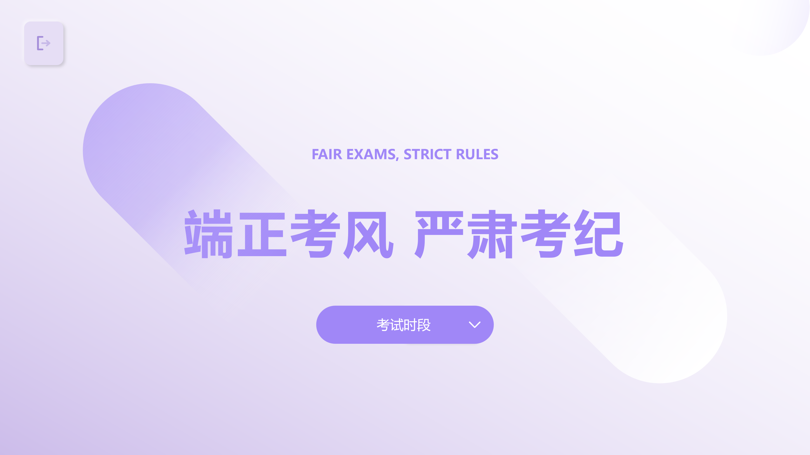
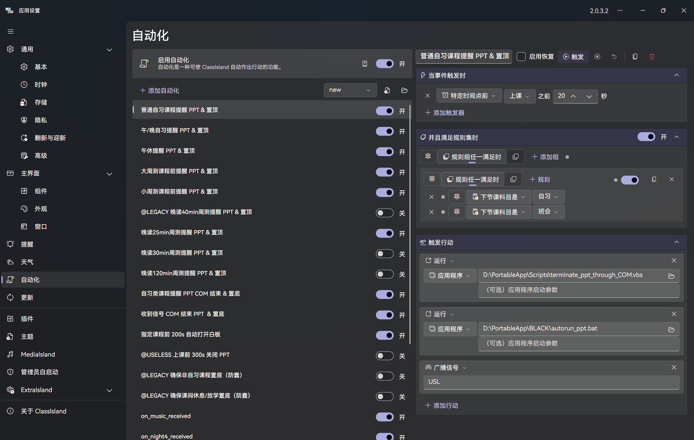
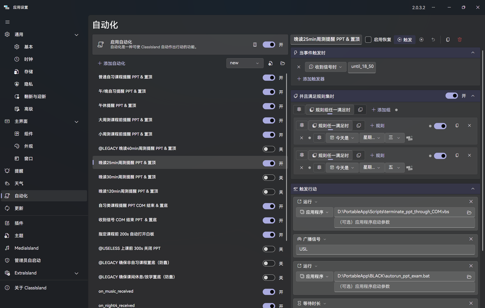
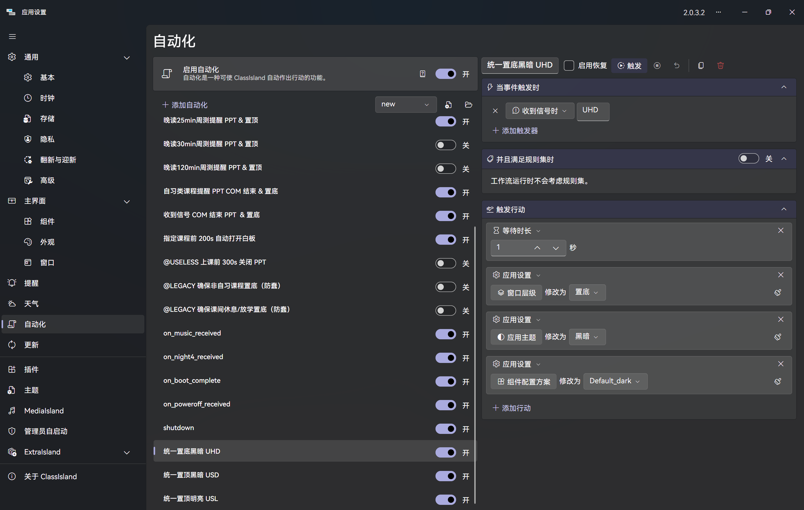

# 自动化实践

## 一台成熟一体机应该具备的品质

- **🕗 6:40**：自动开机（硬件实现）
- **🔔 指定课程前**：自动打开希沃白板
- **🕗 12:40**：自动打开午自习提醒，结束时关闭
- **🕗 13:30**：自动打开午休提醒，结束时关闭

- **🕗 14:07**：自动打开某某音乐并开始播放（SMTC 实现）
- **🕗 14:27**：自动停止音乐播放（SMTC 实现）
- **🔔 自习课**：自动打开自习提醒，下课关闭

- **🔔 周测**：自动打开考试提醒并启动倒计时，考试结束关闭

- **🔔 晚自习**：每节自习自动打开午晚自习提醒，结束时关闭
- **🕗 22:30**：自动关机

## 善用 ClassIsland 自动化

图中配置见 [config/new.json](../config/new.json)